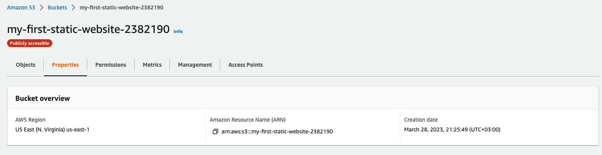

Udacity's **Deploy Static Website on AWS** project. A derivation from my project https://github.com/waleed-alfaifi/invoice-app

**Please notice that I deployed my own project from the `dist` folder instead of using the starter code**.

**Links**:

- Cloudfront URL: https://d2u7x9r1h58wkx.cloudfront.net/
- S3 website endpoint: http://my-first-static-website-2382190.s3-website-us-east-1.amazonaws.com/

**Screenshots**:




### Run locally

```
git clone ...
npm install
npm start
```

then open http://localhost:4200 to see the app.

---

### Credits

- [unDraw](https://undraw.co/) for svg images
- [ICONS8](https://icons8.com/) for the info icon

---

### License

MIT.
